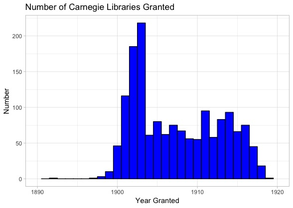
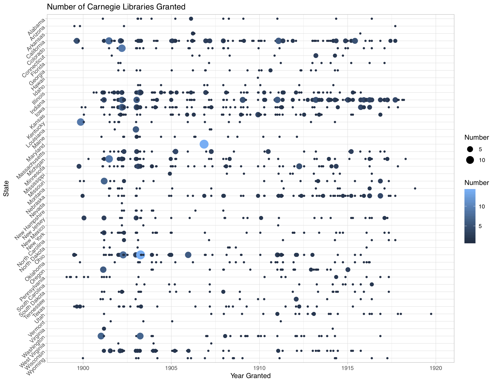

# Carnegie Libraries

I got curious about the trends in building of Carnegie libraries through time. I found a list online [link](https://en.wikipedia.org/wiki/List_of_Carnegie_libraries_in_the_United_States), and I decided to do a bit more webscraping transitioning to data visualization.

To quickly plot the results, there was a very peaked period of Carnegie library construction followed by a plateau until the last library, built in 1923.

I also wanted to look at the state by state breakdown through time, this time making a bubble plot.

More discussion and plots available on my [blog](https://matthewmorriss.weebly.com/codeblog/archives/05-2019)
